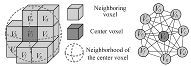

```{r setup, include=FALSE}
knitr::opts_chunk$set(echo = TRUE)
knitr::opts_knit$set(eval.after = 'fig.cap')
```

```{r include=FALSE}
library(imager)
library(ggplot2)
library(dplyr)
library(kableExtra)
library(knitr)
```


## Introduction

A magnetic resonance imaging (MRI) scan of the brain presents an important application of image-based segmentation. For example, an accurately segmented scan can assist in the diagnosis of brain disease and in the preparation of surgery. The three main tissue classes that are normally segmentated in a scan are white matter (WM), gray matter (GM), and cerebrospinal fluid (CSF). Facilitating segmentation requires high contrasts between these tissue types. To generate improved tissue contrasts requires varying parameters of the pulse sequences responsible for causing the hydrogen atoms contained in the body to emit radio frequencies when subjected to a magnetic field. The contrasts achieved through MRI scans is an improvement over computed tomography. However, results still suffer from the following obstacles to segmentation

1. Electronic noise -- disturbance in the electrical signal
2. A bias field -- An unwanted artifact producing inhomogenous intensities of tissue regions
3. The partial volume effect -- overlap of tissue classes within a voxel

The paper [Segmentation of Brain MR Images Through a Hidden Markov Random Field Model and the Expectation-Maximization Algorith](http://citeseerx.ist.psu.edu/viewdoc/download?doi=10.1.1.200.3832&rep=rep1&type=pdf) by Yongyue Zhang et al. provides justification for a Hidden Markov Random Field (HMRF) model together with an Expectation Maximization (EM) method of iterative parameter updating, for a framework that incorperates the spatial dependencies innate to three dimensional scans. It will be demonstrated that this is an improvement over the classical approach using a finite mixture (FM) model.

In this project we adopt this framework to segment an MRI scan obtained from the *mritc* package. The success of this approach offers a means for automatic brain MR image segmentation.

## NIfTI data format
```{r echo=FALSE, out.width = "20%", out.extra='style="float:right; padding:10px"'}
include_graphics("images/voxels.png")
```
The Neuroimaging Informatics Technology Initiative (NIfTI) format is an improvement on the ANALYZE format, retaining a header/image combination of data but also allowing for storage of auxillary information inside the file. The `readMRI` function from the *mritc* package can be used to obtain a three dimensional array with the appropriate image dimensions. The three dimensional analogue to a pixel is called a voxel -- a unit within a three dimensional grid (as shown on the right); representing a signal intensity (ranging from 0 to 250).

Source for figure to the right: https://commons.wikimedia.org/wiki/File:Voxels.svg

```{r include=FALSE}
library(mritc)
library(tkrplot)
```
```{r}
# Read in NIfTI data
T1 <- readMRI(system.file("extdata/t1.rawb.gz", package="mritc"),
              c(91, 109, 91), format="rawb.gz")
# Read in the mask for non-brain matter
mask <- readMRI(system.file("extdata/mask.rawb.gz", package="mritc"),
                c(91, 109, 91), format="rawb.gz")
```

```{r plotting theme, echo=FALSE}
# ggplot theme to be used
plotTheme <- function() {
  theme(
    panel.background = element_rect(
      size = 1,
      colour = "black",
      fill = "white"),
    axis.ticks = element_line(
      size = 2),
    panel.grid.major = element_line(
      colour = "gray80",
      linetype = "dotted"),
    panel.grid.minor = element_line(
      colour = "gray90",
      linetype = "dashed"),
    axis.title.x = element_text(
      size = rel(1.2)),
    axis.title.y = element_text(
      size = rel(1.2)),
    plot.title = element_text(
      size = 20,
      vjust = 1.5)
  )
}
```

```{r include=FALSE}
slice1 <- T1[,,45] # axial
slice2 <- T1[45,,] # coronal
slice3 <- T1[,50,] # saggital
```


```{r, echo = FALSE, fig.show="hold", out.width="33%"}
slice_df1 <- as.cimg(slice1) %>% as.data.frame()
slice_df2 <- as.cimg(slice2) %>% as.data.frame()
slice_df3 <- as.cimg(slice3) %>% as.data.frame()

p1 <- ggplot(slice_df1,aes(x,y))+geom_raster(aes(fill=value)) +
  labs(title = "Axial/Transverse View") +
  scale_x_continuous(expand=c(0,0)) +
  scale_y_continuous(expand=c(0,0)) +
  scale_fill_gradient(low="black",high="white") +
  coord_fixed() +
  plotTheme() +
  theme(legend.position = "none") + theme(plot.margin = unit(c(.2, 0, .2, 5), "cm"))
p1
p2 <- ggplot(slice_df2,aes(x,y))+geom_raster(aes(fill=value)) +
  labs(title = "Saggital View", x="y", y="z") +
  scale_x_continuous(expand=c(0,0)) +
  scale_y_continuous(expand=c(0,0)) +
  scale_fill_gradient(low="black",high="white") +
  coord_fixed() +
  plotTheme() +
  theme(legend.position = "none")
p2

p3 <- ggplot(slice_df3,aes(x,y))+geom_raster(aes(fill=value)) +
  labs(title = "Coronal View", y="z") +
  scale_x_continuous(expand=c(0,0)) +
  scale_y_continuous(expand=c(0,0)) +
  scale_fill_gradient(low="black",high="white") +
  coord_fixed() +
  plotTheme() +
  theme(legend.position = "none") + theme(plot.margin = unit(c(.2, 5, .2, 0), "cm"))
p3
```

## Constructing a Markov Random Field

To make inferences on the data we consider a three dimensional image graph denoted $\mathcal{G} = (\mathcal{V}, \mathcal{E})$, where $\mathcal{V}$ is the set of nodes corresponding to $N = 91 \times 109 \times 91$ voxels making up the three dimensional image, and $\mathcal{E}$ corresponds to the undirected edges connecting the nodes. As mentioned earlier, the set of hidden classes attributable to each node is $\mathcal{S} =\{WM, GM, CSF \}$, which are to be estimated from the signal intensities. Below is a density plots of the intensities taken from three different levels of depth into the saggital plane. The binary mask removes non-brain matter from the data.

```{r, echo = FALSE, fig.show="hold", out.width="50%"}
t1 <- T1
t1[mask==0] <- NA #remove non brain matter using mask

slice1 <- t1[50,,] %>%
  as.cimg() %>%
  as.data.frame()

ggplot(slice1,aes(x,y))+geom_raster(aes(fill=value)) +
  labs(title = "Saggital View: with mask", x="y", y="z") +
  scale_x_continuous(expand=c(0,0)) +
  scale_y_continuous(expand=c(0,0)) +
  scale_fill_gradient(low="black",high="white") +
  coord_fixed() +
  plotTheme() +
  theme(legend.position = "none")

slice2 <- t1[30,,] %>%
  as.cimg() %>%
  as.data.frame()
slice3 <- t1[70,,] %>%
  as.cimg() %>%
  as.data.frame()

library(reshape2) # need to reshape data for overlaid density plots
df <- data.frame("x.50"=slice1$value, "x.30"=slice2$value, "x.70"=slice3$value)
df <- suppressMessages(melt(df, na.rm = TRUE))

# overlaid density plots
ggplot(df,aes(x=value, fill=variable)) + geom_density(alpha=0.25, na.rm = TRUE) + plotTheme() +
  labs(title = "Density plot of Signal Intensities") +
  scale_fill_discrete(name = "x=", labels = c("50", "30", "70"))
  
```

Heuristically, we assume the three modes present in the above density plots correspond to our three classes. CSF often attains lower values, GM tends to land somehwere in the middle, and WM most often have the highest intensities. From this information a mixture of three Gaussian distributions seems like an appropriate model. The limitation of this approach rests with the fact that there is no spacial information accounted for. 

```{r echo=FALSE, out.width = "40%", out.extra='style="float:right; padding:10px"'}

```

To incorperate the greater likelihood of neighbouring voxels to share a class label, an edge $(i,j) \in \mathcal{E}$ must be accompanied by a bias that encodes such a tendency between voxels. A Markov model accounts only for the dependencies between voxels sharing a common edge. That is, for voxel $i$ define the set of its neighbours to be $\mathcal{N_i} = \{j: (i,j) \in \mathcal{E} \}$.

Source for figure to the right:  [Photogrammetric Engineering & Remote Sensing, Volume 84, Number 6](https://www.ingentaconnect.com/contentone/asprs/pers/2018/00000084/00000006/art00015?crawler=true&mimetype=application/pdf#)

The sequence of voxel labels, denoted $\{X_1, \dots, X_{N}\}$ is said to be a Markov Random Field (MRF) on the state space $\mathcal{S}$ with respect to $\mathcal{N}$, if and only if it has the following properties:

1. $P(\mathbf{x}) > 0$, for all $\mathbf{x}$
2. The $X_i$'s are dependent only on their neighboring sites $\mathcal{N_i}$ for all $i$

[The Hammersley-Clifford theorem](https://en.wikipedia.org/wiki/Hammersley%E2%80%93Clifford_theorem) states that a MRF with the properties listed above is equivalently a Gibbs random field -- that is, we may express the MRF as a Gibbs distribution:
$$
P(\mathbf{x}) = \frac{1}{Z}exp\bigg\{-\sum_{c\in\mathcal{C}}\Psi_c(\mathbf{x}) \bigg\}
$$
where $Z$ represents the normalizing constant (or partition function) to make the distribution sum to unity, and $E(\mathbf{x}) = \sum_{c \in \mathcal{C}}\Psi_c(\mathbf{x})$ is known as an *energy function*. Here $\mathcal{C}$ denotes the collection of cliques in the graph $\mathcal{G}$. A clique $c$ is a subgraph of $\mathcal{G}$ that is fully connected -- simply meaning each distinct pair of voxel sites ($i, j \, : i\neq j$) are neighbouring ($i \in \mathcal{N_j} \wedge j \in \mathcal{N_i}$).

The value of the clique potential $\Psi_c(\mathbf{x})$ should decrease $E(\mathbf{x})$ when two neighbouring voxels have similar intensities, and thus increase the joint probability $P(\mathbf{x})$.

## A Special Case of a Hidden Markov Model

Without the spacial property incorperated by the definition of the neighbourhood system $\{\mathcal{N_i}, i = 1, 2, \dots, N\}$ the sequence of voxel labels can be characterized by a first order Markov chain whose state space is hidden and cannot be observed. This implies a proper hidden Markov model (HMM). However, to model the spatial property of a two or three dimensional image, we assume the generating stochastic process is the more general Markov random field; as in the previous section.

In addition to the hidden random field $\{X_i, i = 1, 2, \dots, N \}$ we must model the *observable random field* $Y = \{Y_i, i = 1,2, \dots, N \}$ having the finite state space $\mathcal{D} = \{0,1, \dots, 250\}$ representing the voxel intensities. We call $Y$ the *emitted random field*, where $Y_i \perp Y_j  \, | \, \mathbf{x}$ for $i \neq j$.

Given a sequence of class labels $\{x_i \}$ the likelihood of each observed intensity value has the conditional probability distribution $p(y_i \, | \, x_i, \theta_s)$, with $\theta_s$ dependent on the states $s \in \mathcal{S}$. Accounting for the local dependencies within neighbourhoods $\mathcal{N}_i$ from the MRF, each pair $(X_i, Y_i)$ has the joint probability

$$
P(y_i , x_i \, | \, x_{\mathcal{N}_i}) = P(y_i \, | x_i)P(x_i \, | \, x_{\mathcal{N}_i})
$$
by applying Bayes' rule (Yongyue Zhang et al., eq (8)). Thus, by marginalizing over the states $s \in \mathcal{S}$ obtain
$$
\begin{aligned}
p(y_i \, | \, x_{\mathcal{N}_i}, \, \theta) &= \sum_{s \in \mathcal{S}}p(y_i, s \, | \, x_{\mathcal{N}_i}, \theta) \\
&= \sum_{s \in \mathcal{S}} f(y_i; \theta_s)p(s \, | x_{\mathcal{N}_i})
\end{aligned}
$$
where $\theta = \{\theta_s, s \in \mathcal{S} \}$ (Yongyue Zhang et al., eq (9)). Where Zhang (2001) defines this to be the *hidden Markov random field* model. We assume that the intensity values are independent and normally distributed with parameters $\theta_s = (\mu_s, \sigma_s)^T$ depending on the tissue class. That is,

$$
p(\mathbf{y} \, | \, \mathbf{x}_{\mathcal{N}}, \, \theta) = \prod_{i=1}^N\sum_{s\in \mathcal{S}}\mathcal{N}(y_i \, ; \, \mu_s, \sigma_s)p(s \, |\, x_{\mathcal{N}_i})
$$
It can be seen that if we had assumed that the tissue types were independent of each other, the equation above reduces to the finite normal mixture model -- thus highlighting the key difference between the HMRF model and the FM model. The parameters for an FM model can be learned through a standard EM approach, which we shall compare.

## Tissue Classification using Iterated Conditional Modes

Class labels $\mathbf{x}$ will be estimated via the  *maximum a-posteriori* criterion. That is,
$$
\begin{aligned}
\hat{\mathbf{x}} &= \text{arg}\max_{\mathbf{x}} \{P(\mathbf{y} \, | \, \mathbf{x})P(\mathbf{x}) \} \\
&= \text{arg}\max_{\mathbf{x}} \bigg\{\prod_{i=1}^N\mathcal{N}(y_i \, ; \, \mu_s, \sigma_s) \, \big[e^{-E(\mathbf{x})} \big] \bigg\} \\
&= \text{arg}\min_{\mathbf{x}}\bigg\{\sum_{i=1}^N\bigg[\frac{(y_i-\mu_{x_i})^2}{2\sigma^2_{x_i}} + log \, \sigma_{x_i} \bigg] +  \sum_{c\in\mathcal{C}}\Psi_c(\mathbf{x})\bigg\}
\end{aligned}
$$
Multiple authors have suggested using the *iterated condition modes* (ICM) algorithm, which takes turns maximizing the probability of each parameter conditioned on the others. It has the advantage of fast convergence (only requiring a few iterations), but can get trapped at local maxima (or minima in this case).

### Incorperating Partial Volume Effect

When considering the MRF model $p(\mathbf{x})$ we may decide to include the realistic assumption that not all voxels are homogenous. It is possible that multiple tissue classes occupy the same voxel; this issue is known as the *partial volume effect*. Suppose we introduce extra classes CSF/GM with $\mu_{CSF/GM}=\frac{1}{2}(\mu_{CSF} + \mu_{GM})$, $\sigma^2_{CSF/GM}=\frac{1}{2}(\sigma^2_{CSF} + \sigma^2_{GM})$ and GM/WM with parameters defined similairly. The partial volume HMRF-EM model can be used with `mritc.pvhmrfem(...)` from the *mritc* package.

## Segmentation with Bias Field Correction

An MRI machine generates a magnetic field in order to cause hydrogen atoms within the brain to emit a radio frequency. These desired frequencies can be corrupted by another low frequency artifact known as a *bias field*. It is generally considered to be noise caused by equipment -- thus scans produced by older machines are more suspect. An automatic correction is available through `mritc.hmrf` with `bias = TRUE`.

```{r echo=FALSE, out.width = "30%", out.extra='style="float:right; padding:10px"'}
include_graphics("images/bias_field.png")
```

1. **Expectation Step**
  + Estimate the bias field component <br> \vspace{5pt} $\quad B^{(k)} = \text{arg}\max_{B} \,\,p(B \, | \, \mathbf{y}, \mathbf{x}^{(k-1)}, \theta^{(k-1)})$

  + Estimate class labels <br> $\quad \mathbf{x}^{(k)} = \text{arg}\max_{\mathbf{x}} \,\, P(\mathbf{x} \, | \, \mathbf{y}, B^{(k)}, \theta^{(k)})$

2. **Maximization Step**
  + Obtain updates for model parameters <br> $\quad \theta^{(k+1)} = \text{arg}\max_{\mathbf{\theta}} \,\, P\big(\mathbf{y} \, | \, \theta, \mathbf{x^{(k)}}, B^{(k)} \big)$


Source for figure on the right: [A New Multistage Medical Segmentation Method Based on Superpixel and Fuzzy Clustering](https://www.researchgate.net/figure/The-illustration-of-bias-field-in-MRI-image_fig12_261738082)

## Experiments

In the following implementations we adopt the pure voxel assumption. That is, we do not consider the partial volume effect. This is because we only have data containing the true labels for three classes, and therefore cannot produce a confusion table assuming the extra two combination classes discussed earlier.

### Initializing Parameters with Otsu's Method

Both the EM (for model parameters) and ICM (for label estiamtion) algorithms are not guaranteed to converge globally. Thus, the choice of initial conditions can determine the success of the segmentation.

Otsu's method can be used to determine estimates of the means and variances for each class from the grayscale histogram of an image. The algorithm seeks to find thresholds which minimize the intraclass variances.
```{r}
y <- T1[mask==1]
initial <- initOtsu(y, 2)
prop <- initial$prop
mu <- initial$mu
sigma <- initial$sigma
```

```{r include=FALSE}
library(gridExtra)
library(gtable)
library(grid)
```

```{r echo = FALSE, fig.align="center", out.width="65%"}
summarytable <- as.data.frame(initial) %>%
  round(2)

rownames(summarytable) <- c("CSF", "GM", "WM")
# Set theme to allow for plotmath expressions
tt <- ttheme_default(colhead=list(fg_params = list(parse=TRUE)), padding = unit(c(0.5,0.5), "cm"))
tbl <- tableGrob(summarytable, theme=tt)
tbl <- gtable_add_grob(tbl,
        grobs = rectGrob(gp = gpar(fill = NA, lwd = 2)),
        t = 2, b = nrow(tbl), l = 1, r = ncol(tbl))
tbl <- gtable_add_grob(tbl,
        grobs = rectGrob(gp = gpar(fill = NA, lwd = 2)),
        t = 1, l = 1, r = ncol(tbl))


d <- rnormmix(10000, prop=prop, mu=mu, sigma=sigma) %>%
  as.data.frame()
plt <- ggplot(data.frame("y"=y), aes(x=y)) + geom_histogram(aes(y=..density..), bins=45, fill="darkgrey", colour="black") +
  geom_density(aes(x=y), d, size = 0.70, fill = "steelblue", alpha = 0.5) + plotTheme() +
  labs(title="Otsu Initializations", x="Intensity") +
  theme(plot.margin = unit(c(0.4, 0.5, -2.4, 0.1), "cm"))


grid.arrange(plt, tbl,
             ncol=2,
             as.table=TRUE,
             heights = c(2.8,1),
             widths = c(2.8,1.5))
```

The estimates for initial parameters can be fit to the distribution of signal intensities as shown above. By inspection they appear to be quite reasonable.

### Model Fitting and Evaluation

In this section we compare two proposed models. The FM model, which again does not account for any spacial dependencies between voxels, can be fitted using the EM algorithm with our initialized determined in the previous section by Otsu's method.

```{r}
tc.em <- mritc.em(y, prop=prop, mu=mu, sigma=sigma, verbose = FALSE)
```

The HMRF-EM model is then fitted using a neighbourhood structure consisting of six nodes. The `makeMRIspatial` function from the *mritc* package can be used to get various spatial features for the data to be used as inputs for the `tc.hmrfem` function.

```{r}
mrispatial <- makeMRIspatial(mask, nnei = 6, sub = FALSE)
```

This creates parameters for the neighbourhood structure and the blocks; capturing the conditional independence of voxels given the voxels of another block.

```{r}
tc.hmrfem <- mritc.hmrfem(y, mrispatial$neighbors, mrispatial$blocks, mu=mu, sigma=sigma, verbose = FALSE)
```

Next, we use create the matrix of true proportions of each class per voxel for evaluation using the `measureMRI` function. As an input the truth matrix will have rows corresponding to each voxel, and columns giving the actual probability that a voxel is of each tissue type.   

```{r}
csf <- readMRI(system.file("extdata/csf.rawb.gz", package = "mritc"),
 c(91, 109, 91), format = "rawb.gz")
gm <- readMRI(system.file("extdata/gm.rawb.gz", package = "mritc"),
 c(91, 109, 91), format = "rawb.gz")
wm <- readMRI(system.file("extdata/wm.rawb.gz", package = "mritc"),
 c(91, 109, 91), format = "rawb.gz")

truth <- cbind(csf[mask == 1], gm[mask == 1], wm[mask == 1]) # ture proportions
truth <- truth/255 # matrix of true classification results
```

The `measureMRI` function will output density plots comparing the actual density against the estimated for each tissue class with labels (1) for CSF, (2) for GM, and (3) for WM.

```{r fig.show="hold", out.width="50%"}
res.hmrf <- measureMRI(T1[mask == 1], truth, tc.hmrfem$prob)
res.em <- measureMRI(T1[mask == 1], truth, tc.em$prob)
```

The predicted results appear best for the HMRF-EM method across all tissue types. The EM estimates obtained with the FM model are most innacurate at distinguishing between WM and GM. This can be explained by the fact that CSF and WM do not often appear adjacent, and so are more easily separable. To improve the distinction between WM and GM, occuring frequently together, it is necessary to incorperate this spatial relationship. This improvement is evidenced in the superior performance of the HMRF-EM results. To further support this, we can look at the mis-classification rates (MCR), and a confusion matrix. 

```{r echo=FALSE, fig.show="hold", out.width="50%"}
actual <- c(rep("CSF",3), rep("GM",3), rep("WM",3))
predicted <- c(rep(c("CSF", "GM", "WM"), 3))
value.hmrf <- as.vector(t(res.hmrf$conTable)) # obtain values from table
value.hmrf <- round(value.hmrf, 2)
ctable.hmrf <- data.frame(actual, predicted, value.hmrf)

value.em <- as.vector(t(res.em$conTable)) # obtain values from table
value.em <- round(value.em, 2)
ctable.em <- data.frame(actual, predicted, value.em)


ggplot(data =  ctable.hmrf, mapping = aes(x = predicted, y = actual)) +
  geom_tile(aes(fill = value.hmrf), colour = "white") +
  geom_text(aes(label =  value.hmrf), vjust = 1) +
  scale_fill_gradient(low = "white", high = "steelblue") +
  plotTheme() + theme(legend.position = "none") +
  labs(title = "HMRF-EM")

ggplot(data =  ctable.em, mapping = aes(x = predicted, y = actual)) +
  geom_tile(aes(fill = value.em), colour = "white") +
  geom_text(aes(label =  value.em), vjust = 1) +
  scale_fill_gradient(low = "white", high = "steelblue") +
  plotTheme() + theme(legend.position = "none") +
  labs(title = "FM-EM")
```

The confusion matrix for the FM model shows decent performance in properly identifying CSF and GM with a classification accruacy of 90% and 96% respectively. Again, we can see that the limitations of the FM model account for the lower accuracy given for WM classification (79%). The confusion matrix on the left gives the improved results from the HMRF-EM framework. The MCR for the FM model and the HMRF model are `r round(res.em$misclass, 3)` and `r round(res.hmrf$misclass, 3)` respectively.

### Example Segmentation Results {.tabset}

The following plots are an example of a complete segmentation. In each plane we have dark gray pixels marking CSF, light gray pixels marking GM, and white pixels marking WM. To view an interactive visualization, allowing one to adjust the depth of each plane see my [Interactive Result Plots](https://derekwayne.shinyapps.io/brain_mri_segmentation/) made with *ShinyR*.

```{r include=FALSE}
tc.icm <- mritc(T1, mask, method = "ICM")
t1 <- T1
t1[mask == 1] <- 0
icm.class <- max.col(tc.icm$prob)
tc.icm$mask[tc.icm$mask == 1] <- icm.class
```
```{r echo=FALSE}
plt_brain <- function(plane = "saggital", k, WM=T, GM=T, CSF=T) {
  # mask is a three dimensional array -- from mritc object
  
  if (plane == "saggital") {
    slice <- T1[k,,] # original image
    wm <- as.cimg(tc.icm$mask[k,,]) %>% as.data.frame()
    gm <- as.cimg(tc.icm$mask[k,,]) %>% as.data.frame()
    csf <- as.cimg(tc.icm$mask[k,,]) %>% as.data.frame()
  }
  else if (plane == "coronal") {
    slice <- T1[,k,] # original image
    wm <- as.cimg(tc.icm$mask[,k,]) %>% as.data.frame()
    gm <- as.cimg(tc.icm$mask[,k,]) %>% as.data.frame()
    csf <- as.cimg(tc.icm$mask[,k,]) %>% as.data.frame()
  }
  else {
    slice <- T1[,,k] # original image
    wm <- as.cimg(tc.icm$mask[,,k]) %>% as.data.frame()
    gm <- as.cimg(tc.icm$mask[,,k]) %>% as.data.frame()
    csf <- as.cimg(tc.icm$mask[,,k]) %>% as.data.frame()
  }
  
  slice_df <- as.cimg(slice) %>% as.data.frame() # df for ggplot2
  
  # create segmented overlays
  # WM
  wm$value[wm$value != 3] <- NA # isolate WM
  wm$value[!is.na(wm$value)] <- "#f6bb13" # assign a colour val to tissue type
  # GM
  gm$value[gm$value != 2] <- NA
  gm$value[!is.na(gm$value)] <- "#a83e27"
  # CSF
  csf$value[csf$value != 1] <- NA
  csf$value[!is.na(csf$value)] <- "#91ae34"
  
  plt <- ggplot(slice_df,aes(x,y)) + geom_raster(aes(fill=value)) +
    scale_x_continuous(expand=c(0,0)) +
    scale_y_continuous(expand=c(0,0)) +
    scale_fill_continuous(low="black",high="white", na.value = NA) +
    coord_fixed() +
    plotTheme() +
    theme(legend.position = "none")
  
  # conditional overlays
  if (WM == T) {
    plt <- plt + annotate(geom = 'raster', x = wm$x, y = wm$y,
           fill = wm$value, na.rm = TRUE, alpha=0.8)
  }
  if (GM == T) {
    plt <- plt + annotate(geom = 'raster', x = gm$x, y = gm$y,
           fill = gm$value, na.rm = TRUE, alpha=0.8)
  }
  if (CSF == T) {
    plt <- plt + annotate(geom = 'raster', x = csf$x, y = csf$y,
           fill = csf$value, na.rm = TRUE, alpha=0.8)
  }
  
  plt
}
```

#### Transverse Plane

```{r echo = FALSE, fig.align="center"}
plt_brain(plane = "transverse", k = 45)
```

#### Saggital Plane

```{r echo = FALSE, fig.align="center"}
plt_brain(plane = "saggital", k = 45) + labs(x="y", y="z")
```

#### Coronal Plane

```{r echo = FALSE, fig.align="center"}
plt_brain(plane = "coronal", k = 45) + labs(y="z")
```


## Conclusion

The framework implemented in this project is based on the work by Zhang et al. (2001). The research has demonstrated that the HMRF model is more robust, and an overall improvement over the popular FM model. We also addressed specific problems in obtaining an accurate segmentation, including: partial volume effect and presence of a bias field. The *mritc* package was used throughout and contains numerous functions to handle specific data objectives. Furthermore, because MRI data can be extremely large in size, the package performs some of its heavy computations with **C** code and the OpenMP framework for shared memory parallel computing; making it very efficient. Thus, the HMRF model provides an improved automatic approach to brain MRI segmentation, offering more accurate tissue classification over more traditional models.


